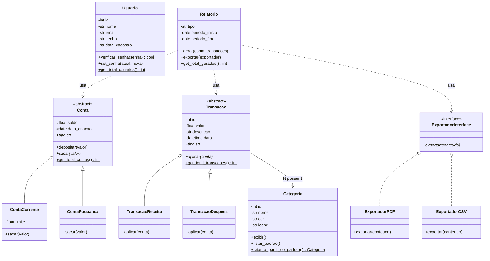

# 💳 SOTF — Sistema de Organização de Transações Financeiras

> Projeto da disciplina de **Programação Orientada a Objetos** — UFPB 2026
> **Etapa 2**: Métodos e variáveis de instância, encapsulamento com `@property`, herança, polimorfismo, interfaces e SOLID.

---

## 📋 Sumário

- [Sobre o Projeto](#-sobre-o-projeto)
- [Estrutura de Arquivos](#-estrutura-de-arquivos)
- [Diagrama de Classes](#-diagrama-de-classes)
- [Visão Geral das Classes](#-visão-geral-das-classes)
- [Conceitos de POO — Etapa 2](#-conceitos-de-poo--etapa-2)
- [Diário de Bordo](#-diário-de-bordo)
- [Como Executar](#️-como-executar)
- [Próximas Etapas](#-próximas-etapas)
- [Equipe](#-equipe)

---

## 📌 Sobre o Projeto

O **SOTF** é um sistema de gerenciamento financeiro pessoal em Python. Usuários cadastram contas, registram transações, as classificam por categoria e acompanham o histórico — tudo com encapsulamento real: nenhum dado sensível é alterado sem passar por uma regra de negócio validada.

Na **Etapa 1** o foco foi classes, atributos de instância/classe e encapsulamento manual com `get_`/`set_`. Na **Etapa 2**, o projeto evoluiu para `@property`, hierarquias de herança com polimorfismo real e interfaces formais (`ABC`), aplicando os cinco princípios do SOLID.

---

## 📁 Estrutura de Arquivos

```
SOTF/
├── usuario.py       # Usuario — autenticação e dados do usuário
├── conta.py         # Conta (abstrata) + ContaCorrente + ContaPoupanca
├── categoria.py     # Categoria — classificação de transações
├── transacao.py     # Transacao (abstrata) + TransacaoReceita + TransacaoDespesa
├── relatorio.py      # Relatorio + ExportadorInterface (PDF/CSV)
└── README.md
```

---

## 📊 Diagrama de Classes



**Legenda:** `<|--` herança · `<|..` implementação de interface · `-->` associação · `..>` dependência · `#` protegido · `-` privado · `*` abstrato · `$` classmethod/static.

`Usuario` ainda não está conectado às demais classes no código — essa integração (usuário → várias contas) é o primeiro item da [Etapa 3](#-próximas-etapas).

---

## 🔎 Visão Geral das Classes

| Arquivo | Classe(s) | Responsabilidade | Destaques da Etapa 2 |
|---|---|---|---|
| `usuario.py` | `Usuario` | Credenciais e dados do usuário | `nome`/`email` viraram `@property` com validação; senha nunca é exposta |
| `categoria.py` | `Categoria` | Classifica transações | `nome`/`cor`/`icone` viraram `@property`; guarda de construção corrigida |
| `conta.py` | `Conta` (ABC), `ContaCorrente`, `ContaPoupanca` | Saldo e regras de saque | `Conta` é abstrata (interface parcial); cada subclasse sobrescreve `sacar()` |
| `transacao.py` | `Transacao` (ABC), `TransacaoReceita`, `TransacaoDespesa` | Registro de movimentações | Nova hierarquia: cada subtipo sabe como `aplicar()` seu efeito numa conta |
| `relatorio.py` | `Relatorio`, `ExportadorInterface`, `ExportadorPDF`, `ExportadorCSV` | Análise de período e exportação | Interface de exportação (DIP/ISP) — `Relatorio` não conhece PDF nem CSV |

Todo atributo privado usa `__` (name mangling — `self.__saldo` vira `_Conta__saldo`), e todo contador de classe (`__total_*`) é acessado só por `@classmethod`.

---

## 🧠 Conceitos de POO — Etapa 2

### 1. Encapsulamento com `@property`

Os `get_`/`set_` manuais da Etapa 1 viraram propriedades — mesma proteção, sintaxe de atributo comum:

```python
@property
def limite(self) -> float:
    return self.__limite

@limite.setter
def limite(self, novo_limite: float) -> None:
    if novo_limite < 0:
        raise ValueError("Limite não pode ser negativo.")
    self.__limite = novo_limite

conta.limite = 1000.0   # chama o setter e valida
```

Métodos que dependem de **mais de um argumento** (`set_senha(atual, nova)`, `set_periodo(inicio, fim)`) continuam como métodos comuns — uma property só aceita um valor do lado direito do `=`.

### 2. Herança

`Conta` e `Transacao` viraram classes abstratas (`ABC`) com atributos e regras comuns; cada subclasse herda a estrutura e especializa o que muda:

```python
class Conta(ABC):
    def depositar(self, valor): ...      # igual para todas as contas
    @abstractmethod
    def sacar(self, valor): ...          # cada conta decide como

class ContaCorrente(Conta):
    def sacar(self, valor):              # pode usar saldo + limite
        if valor > (self._saldo + self.__limite): raise ValueError(...)

class ContaPoupanca(Conta):
    def sacar(self, valor):              # só pode usar o saldo
        if valor > self._saldo: raise ValueError(...)
```

### 3. Polimorfismo

O mesmo código chama `.sacar()` ou `.aplicar()` sem saber a subclasse concreta — cada objeto resolve seu próprio comportamento em tempo de execução:

```python
transacoes = [TransacaoDespesa(400, "Aluguel", cat), TransacaoReceita(3000, "Salário", cat)]
for t in transacoes:
    t.aplicar(conta)   # despesa saca, receita deposita — mesma chamada, efeitos opostos
```

### 4. Interfaces

`ExportadorInterface` é uma interface pura (só métodos abstratos, sem estado) — `ExportadorPDF` e `ExportadorCSV` a implementam de forma intercambiável:

```python
class ExportadorInterface(ABC):
    @abstractmethod
    def exportar(self, conteudo: str) -> None: ...

relatorio.exportar(ExportadorPDF())   # ou ExportadorCSV() — Relatorio não muda
```

### 5. SOLID

| Princípio | Onde aparece |
|---|---|
| **S**RP | Cada classe tem uma responsabilidade: `Conta` cuida de saldo, `Relatorio` de análise, `ExportadorPDF`/`CSV` só exportam |
| **O**CP | Novo tipo de conta, transação ou exportador = nova subclasse, sem tocar nas existentes |
| **L**SP | `ContaCorrente`/`ContaPoupanca` e `TransacaoReceita`/`TransacaoDespesa` substituem suas classes-base sem quebrar nada |
| **I**SP | `ExportadorInterface` tem um único método — clientes não dependem de operações que não usam |
| **D**IP | `Relatorio.gerar()` depende de `Conta` (abstrata); `Relatorio.exportar()` depende de `ExportadorInterface`, nunca de PDF/CSV diretamente |

---

## 🪵 Diário de Bordo

### Herdado da Etapa 1 (resumo)
- **Name mangling em `__atributo`** é sensível a digitação — um typo cria um atributo novo sem erro de sintaxe.
- **`__del__` roda para todo objeto vivo ao fim do programa**, não só quando `del` é chamado manualmente — por isso ele nunca deve ter `print()` incondicional (ver abaixo).
- **Saldo não tem setter direto** — só muda por `depositar()`/`sacar()`, que validam e mantêm a lógica de negócio coerente.

### Novos erros corrigidos na Etapa 2

**1. `__del__` decrementava contador de objetos que falharam ao construir.**
`Categoria` e `Transacao` validavam os dados e só *depois* incrementavam `__total_*`. Se a validação lançasse `ValueError`, o objeto (já existente em memória antes do `__init__` rodar) ainda acionava `__del__`, decrementando um contador que nunca tinha sido somado — contagem ficava incorreta.
**Solução:** guarda `self.__construido = True` como última linha do construtor; `__del__` só decrementa se `hasattr(self, "_Classe__construido")`. Aplicada em todas as classes com contador (`Usuario`, `Categoria`, `Conta`, `Transacao`, `Relatorio`).

**2. `ContaCorrente.__init__` deixava o limite passar sem validação.**
O construtor fazia `self.__limite = limite` diretamente, ignorando a regra de "limite não pode ser negativo" que só existia no `@limite.setter`. Dava para criar `ContaCorrente(limite=-500)` sem erro nenhum.
**Solução:** o construtor agora atribui via `self.limite = limite`, passando pela property e reaproveitando a mesma validação.

**3. Erros de validação eram só `print()` + `return` silencioso.**
Setters como `set_nome`, `set_cor`, `sacar()` imprimiam uma mensagem e voltavam sem alterar nada — mas o chamador não tinha como saber, via código, que a operação falhou (só lendo o console). Isso mistura estilos com os construtores, que já usavam `raise`.
**Solução:** todo setter/regra de negócio inválida agora levanta `ValueError`; o chamador decide se trata com `try/except` ou deixa propagar.

**4. Referência residual de variável de `for` atrasava o `__del__`.**
No primeiro rascunho da demo de `transacao.py`, um `for t in (t1, t2): t.aplicar(conta)` deixava a variável `t` do laço apontando para `t2` mesmo depois do loop — Python não cria escopo de bloco para `for`. Ao rodar `del t2` logo em seguida, o contador de referências não zerava e `__del__` não disparava na hora esperada.
**Solução:** trocado por chamadas explícitas (`t1.aplicar(conta)`, `t2.aplicar(conta)`), sem variável de laço sobrevivendo ao escopo.

**5. `__del__` com `print()` incondicional em `conta.py`/`relatorio.py`.**
Mesma armadilha da Etapa 1 (item acima) tinha voltado nessas duas classes — o destrutor imprimia uma mensagem toda vez, inclusive para os objetos ainda vivos quando o programa termina.
**Solução:** removidos; o destrutor só decrementa o contador, sem efeito colateral no console.

---

## ▶️ Como Executar

Pré-requisito: Python 3.8+.

```bash
git clone https://github.com/LuizRamalho11/SOTF.git
cd SOTF

python usuario.py
python categoria.py
python conta.py
python transacao.py
python relatorio.py
```

Cada arquivo tem um bloco `if __name__ == "__main__":` com uma demonstração própria do módulo.

---

## 🚀 Próximas Etapas

### Etapa 3 — Recursão, Tabelas Hash, Grafos, Busca em Largura, Streamlit

- [ ] Conectar `Usuario` às demais classes (um usuário possui N contas)
- [ ] Interface visual com **Streamlit**
- [ ] Tabela hash para busca rápida de transações por categoria
- [ ] Grafo de categorias com visualização de relacionamentos
- [ ] Pesquisa em largura no histórico financeiro
- [ ] Recursão nos relatórios para consolidação de períodos aninhados
- [ ] Revisão de SOLID no código alterado

### Expansões futuras (além da disciplina)

- [ ] Persistência com SQLite
- [ ] Hash de senha com `bcrypt`
- [ ] Dashboard com gráficos por categoria

---

## 👥 Equipe

| Integrante | Responsabilidade |
|---|---|
| Luiz Felipe Ramalho Reis | `usuario.py` + `categoria.py` |
| Luy Koji Castelo Branco | `conta.py` + `relatorio.py` |
| Gabriel José | `transacao.py` |

---

## 📚 Disciplina

**Programação Orientada a Objetos** — Universidade Federal da Paraíba (UFPB), 2026
