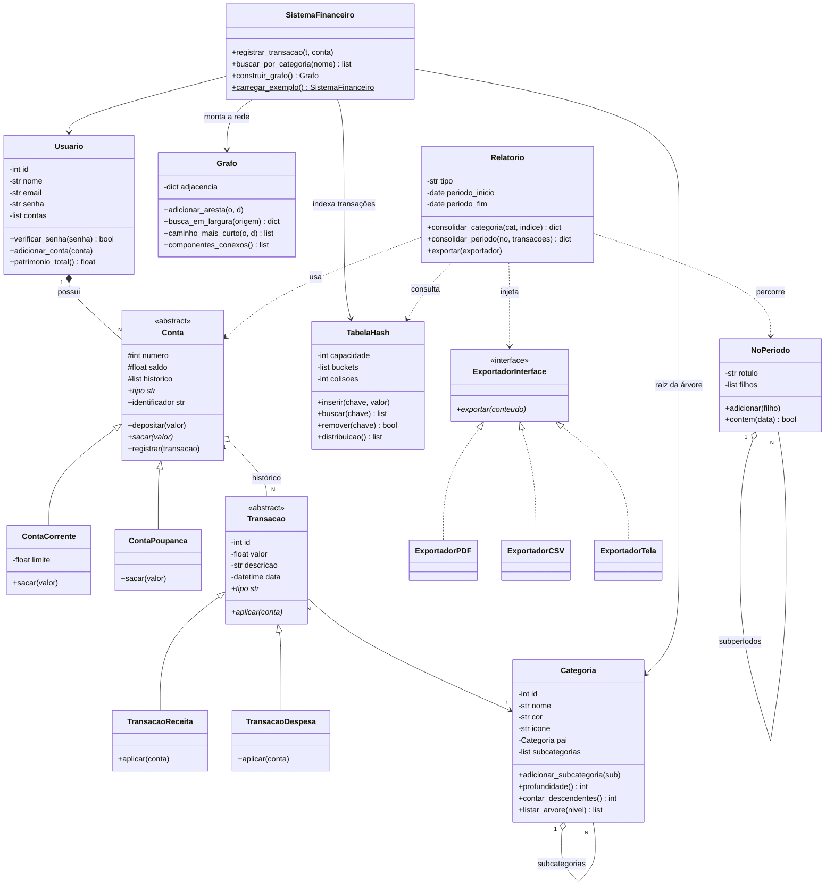

# 💳 SOTF — Sistema de Organização de Transações Financeiras

> Projeto da disciplina de **Programação Orientada a Objetos** — UFPB 2026
> **Etapa 3**: diagrama de classes atualizado, recursão, tabelas hash, grafos, pesquisa em largura, Streamlit e revisão de SOLID.

---

## 📋 Sumário

- [Sobre o Projeto](#-sobre-o-projeto)
- [Como Executar](#️-como-executar)
- [Estrutura de Arquivos](#-estrutura-de-arquivos)
- [Diagrama de Classes](#-diagrama-de-classes)
- [Etapa 3 — Estruturas de Dados](#-etapa-3--estruturas-de-dados)
  - [Tabela Hash](#tabela-hash)
  - [Grafo e Pesquisa em Largura](#grafo-e-pesquisa-em-largura)
  - [Recursão](#recursão)
  - [Interface com Streamlit](#interface-com-streamlit)
- [Revisão de SOLID](#-revisão-de-solid-no-código-alterado)
- [Etapas 1 e 2 (resumo)](#-etapas-1-e-2--resumo)
- [Diário de Bordo](#-diário-de-bordo)
- [Uso de IA Generativa](#-uso-de-ia-generativa)
- [Equipe](#-equipe)

---

## 📌 Sobre o Projeto

O **SOTF** é um sistema de gerenciamento financeiro pessoal em Python. O usuário cadastra contas, registra transações, classifica tudo por categoria e acompanha o histórico — com encapsulamento real: nenhum dado sensível muda sem passar por uma regra de negócio validada.

| Etapa | Foco |
|---|---|
| 1 | Classes, atributos de classe/instância, encapsulamento com `get`/`set`, construtores e destrutores |
| 2 | `@property`, herança, polimorfismo, interfaces (`ABC`) e SOLID |
| **3** | **Recursão, tabela hash, grafo, pesquisa em largura e interface Streamlit** |

Na Etapa 3 as estruturas de dados foram **implementadas do zero** (`estruturas/`): a matéria cobra hash, grafo e BFS como conteúdo, então usar `dict` pronto ou `networkx` não atenderia. Bibliotecas externas entram apenas para desenhar a tela.

---

## ▶️ Como Executar

Pré-requisito: Python 3.8+.

```bash
git clone https://github.com/LuizRamalho11/SOTF.git
cd SOTF
pip install -r requirements.txt

# Interface gráfica (principal)
streamlit run app.py
```

No app, clique em **“🎬 Carregar dados de exemplo”** para popular usuário, contas, categorias e transações de uma vez.

Cada módulo também roda sozinho, com demonstração própria no terminal:

```bash
python estruturas/tabela_hash.py   # colisões, encadeamento e redimensionamento
python estruturas/grafo.py         # BFS, níveis, caminho mínimo e componentes
python categoria.py                # hierarquia e métodos recursivos
python relatorio.py                # consolidação recursiva (categorias e períodos)
python sistema.py                  # integração completa
python usuario.py  |  python conta.py  |  python transacao.py
```

> No Windows, se os acentos e emojis saírem trocados no terminal, use
> `set PYTHONIOENCODING=utf-8` antes de rodar. É só exibição — não afeta a lógica.

---

## 📁 Estrutura de Arquivos

```
SOTF/
├── app.py                 # Interface Streamlit (6 abas)
├── sistema.py             # Fachada que integra domínio + estruturas
├── usuario.py             # Usuario (possui N contas)
├── conta.py               # Conta (abstrata) + ContaCorrente + ContaPoupanca
├── categoria.py           # Categoria + hierarquia (árvore) + recursão
├── transacao.py           # Transacao (abstrata) + Receita + Despesa
├── relatorio.py           # Relatorio + NoPeriodo + interface de exportação
├── estruturas/            # ← Etapa 3: estruturas implementadas do zero
│   ├── tabela_hash.py     # TabelaHash (encadeamento separado)
│   └── grafo.py           # Grafo (lista de adjacência) + BFS
├── requirements.txt
└── README.md
```

---

## 📊 Diagrama de Classes



**Legenda:** `<|--` herança · `<|..` implementa interface · `*--` composição · `o--` agregação · `..>` dependência · `*` abstrato · `$` método de classe

---

## 🧱 Etapa 3 — Estruturas de Dados

### Tabela Hash

`estruturas/tabela_hash.py` — indexa **transações por nome de categoria**.

- **Função hash polinomial base 31**: `h = (h * 31 + ord(c)) % capacidade`. O 31 é primo e ímpar, então espalha melhor que uma soma simples de caracteres.
- **Colisões por encadeamento separado**: cada bucket guarda uma lista `[chave, [valores]]`; chaves diferentes que caem no mesmo bucket convivem ali.
- **Redimensionamento automático**: passando de `0.7` de fator de carga, a capacidade dobra e **tudo é reinserido** — obrigatório, porque a função hash usa a capacidade no cálculo, então toda chave muda de lugar.

```python
indice = TabelaHash()
indice.inserir("Alimentação", transacao)
indice.buscar("Alimentação")     # O(1) médio, em vez de varrer tudo
```

Sem o índice, achar as transações de uma categoria custaria **O(n)**. O app mostra a diferença lado a lado: com 10 transações, a varredura linear faz 10 comparações; a hash faz 1 cálculo.

### Grafo e Pesquisa em Largura

`estruturas/grafo.py` — monta a **rede financeira**: `Usuário → Contas → Transações → Categorias`.

Foi usada **lista de adjacência** em vez de matriz porque a rede é esparsa: cada transação liga uma conta a uma categoria, e a matriz gastaria O(V²) para guardar quase só zeros.

A rede tem **ciclos de verdade** — quando duas contas gastam na mesma categoria, ela reconecta os dois ramos (no cenário de exemplo: 19 vértices e 22 arestas; uma árvore teria só 18).

```python
resultado = grafo.busca_em_largura("Usuário: Camila Ferreira")
resultado["niveis"]         # distância em saltos até cada vértice
grafo.caminho_mais_curto(origem, destino)
```

**Por que a fila importa:** o BFS visita em ondas — origem (nível 0), vizinhos (nível 1), vizinhos dos vizinhos (nível 2). A **fila FIFO** é o que garante essa ordem: quem entra primeiro sai primeiro, então nenhum vértice do nível 2 é processado antes de o nível 1 acabar. Trocar a fila por uma pilha transformaria o algoritmo em busca em **profundidade**.

O conjunto `visitados` evita laço infinito nos ciclos, e é marcado **antes** de enfileirar — senão o mesmo vértice entraria duas vezes na fila.

Como o BFS alcança cada vértice pela primeira vez sempre pelo trajeto mais curto, os predecessores que ele registra dão de graça o **caminho mínimo** em número de saltos.

### Recursão

Aplicada em **duas árvores diferentes**:

**1. Árvore de categorias** (`Moradia → Aluguel, Luz`) — em `relatorio.py`:

```python
def consolidar_categoria(self, categoria, indice):
    proprias = [t for t in indice.buscar(categoria.nome) if self.dentro_do_periodo(t.data)]
    total_proprio = sum(t.valor for t in proprias)
    filhos = [self.consolidar_categoria(sub, indice) for sub in categoria.subcategorias]
    return {..., "total": total_proprio + sum(f["total"] for f in filhos)}
```

- **Caso base:** uma folha não tem filhas, o laço não roda e o total é só o próprio.
- **Caso recursivo:** cada filha resolve a própria subárvore.
- As transações vêm da **tabela hash**, então cada nó custa O(1) em vez de varrer a lista.

**2. Árvore de períodos** (`Ano → Semestres → Meses`) — o ano nunca é somado direto: recebe o total dos semestres, que recebem o dos meses.

A própria `Categoria` também usa recursão para operações de estrutura: `profundidade()`, `contar_descendentes()`, `listar_arvore()` e `eh_descendente_de()`.

### Interface com Streamlit

`app.py` — seis abas:

| Aba | O que demonstra |
|---|---|
| 👤 Contas | Herança e polimorfismo: corrente e poupança lado a lado |
| 💸 Transações | `aplicar()` polimórfico; erros de regra de negócio na tela |
| ⚡ Tabela Hash | Buckets, colisões, fator de carga e hash × linear |
| 🕸️ Grafo & BFS | Rede desenhada **por níveis do próprio BFS**, com caminho mínimo destacado |
| 🌳 Categorias | Árvore e consolidação recursiva por subárvore |
| 📊 Relatórios | Consolidação por períodos aninhados e exportação |

O desenho do grafo usa **só matplotlib**: as coordenadas saem dos níveis calculados pelo BFS, ou seja, o mesmo algoritmo que percorre a rede também organiza o layout.

Como o Streamlit **re-executa o arquivo inteiro a cada clique**, todos os objetos de domínio vivem em `st.session_state` — sem isso, cada interação recriaria usuário, contas e transações do zero.

---

## 🧠 Revisão de SOLID no código alterado

| Princípio | Como aparece no código novo |
|---|---|
| **S**RP | `SistemaFinanceiro` só **coordena**: não calcula saldo (é da `Conta`), não valida transação (é da `Transacao`), não soma relatório (é do `Relatorio`). A `Categoria` conhece a própria árvore; **quem soma dinheiro é o `Relatorio`**. |
| **O**CP | `ExportadorTela` foi criado em `app.py` **sem alterar uma linha** de `Relatorio`. Os três botões de exportação chamam o mesmo `relatorio.exportar()`. |
| **L**SP | `ContaCorrente` e `ContaPoupanca` são intercambiáveis: `patrimonio_total()` chama `saldo` sem saber o tipo. Idem para `TransacaoReceita`/`TransacaoDespesa` em `aplicar()`. |
| **I**SP | `ExportadorInterface` tem um único método — nenhum exportador é obrigado a implementar o que não usa. |
| **D**IP | `Relatorio.gerar()` recebe `Conta` (abstrata) e `exportar()` recebe `ExportadorInterface`. As estruturas de dados ficam isoladas: a `Conta` não sabe o que é tabela hash, a `Categoria` não sabe o que é grafo. |

---

## 📚 Etapas 1 e 2 — resumo

**Encapsulamento:** todo atributo privado usa `__` (*name mangling*: `self.__saldo` vira `_Conta__saldo`). Coleções são devolvidas como **cópia** (`historico`, `contas`, `subcategorias`), para ninguém alterar o estado por fora.

**Properties (Etapa 2):** os `get_`/`set_` viraram `@property`, com validação no setter.

```python
@limite.setter
def limite(self, novo_limite):
    if novo_limite < 0:
        raise ValueError("Limite não pode ser negativo.")
    self.__limite = novo_limite
```

Métodos que dependem de **dois argumentos** (`set_senha(atual, nova)`, `set_periodo(inicio, fim)`) continuam métodos comuns — uma property recebe um único valor.

**Herança e polimorfismo:** `Conta` e `Transacao` são abstratas (`ABC`); cada subclasse implementa o contrato à sua maneira — a poupança só saca o que tem, a corrente pode usar o limite.

---

## 🪵 Diário de Bordo

### Etapa 3

**1. IDs repetidos entre objetos vivos.**
O ID vinha do mesmo contador que o destrutor decrementava. Criando A, B, C e apagando B, o próximo objeto nascia com o ID de C — **dois objetos vivos com o mesmo ID**. Passou a doer agora porque o ID identifica a transação na tabela hash e no grafo.
*Solução:* separar os dois papéis — `__ultimo_id` só sobe (gera ID único) e `__total_*` continua subindo e descendo (conta objetos vivos). Aplicado em `Usuario`, `Categoria`, `Transacao` e `Conta`.

**2. A demonstração da tabela hash não mostrava nenhuma colisão.**
A tabela era criada com capacidade 4 justamente para forçar colisões, mas ao passar de 0.7 de fator de carga ela dobrava sozinha, redistribuía as chaves e zerava o contador — o exemplo desfazia o que queria mostrar.
*Solução:* tornar o limite do fator de carga configurável. A demo usa um limite alto para exibir o encadeamento e uma segunda tabela com o limite padrão para mostrar o redimensionamento acontecendo passo a passo.

**3. Risco de import circular ao dar histórico à `Conta`.**
`transacao.py` já importava `conta.py`; importar `Transacao` de volta fecharia o ciclo.
*Solução:* `if TYPE_CHECKING:` com anotação em string (`"Transacao"`) — o import só existe para o verificador de tipos e não roda em tempo de execução.

**4. Recursão infinita se a hierarquia de categorias tivesse ciclo.**
Nada impedia tornar “Finanças” subcategoria da própria neta; qualquer método recursivo rodaria para sempre.
*Solução:* `adicionar_subcategoria()` recusa a operação quando o novo pai já é descendente — validado por `eh_descendente_de()`, que é recursivo.

**5. Seleção obsoleta no seletor de destino do BFS.**
As opções do destino eram “todos os vértices menos a origem”. Ao trocar a origem, o destino escolhido podia sumir da lista e o app ficava com uma seleção inválida.
*Solução:* usar a mesma lista estável nos dois seletores e tratar explicitamente o caso origem = destino (0 saltos).

**6. “Reiniciar sistema” deixava lixo na sessão.**
O botão limpava só `session_state.sistema`, mas widgets com `key` continuavam guardando categorias e contas do sistema destruído.
*Solução:* `st.session_state.clear()` e remoção da `key` do seletor de consolidação, para o Streamlit reidentificar o widget quando a árvore muda.

**7. Ferramenta de teste com limitação própria.**
O `AppTest` do Streamlit falhava ao clicar em seletores cujas opções são objetos quando a página também tem um `st.form`. Reproduzimos a falha num app genérico de 9 linhas: era limitação do harness, não do projeto.
*Solução:* verificar a interface com o que o harness suporta e cobrir a lógica de cada opção por varredura direta — todos os pares de vértices no BFS, todas as chaves da hash e todas as categorias da árvore.

### Etapas 1 e 2 (resumo)

- **`__del__` roda em todo objeto vivo ao fim do programa**, não só no `del` manual — por isso o destrutor não tem `print()`.
- **Destrutor de objeto que falhou no construtor** decrementava contador nunca incrementado — resolvido com a guarda `self.__construido`.
- **`set_saldo()` foi removido**: o saldo só muda por `depositar()`/`sacar()`, que validam e registram.
- **Validação de saque** precisa considerar `saldo + limite`, não só o saldo.
- **Variável de laço `for` sobrevive ao laço** em Python e adiava o `__del__`.
- **Erros silenciosos**: setters que só imprimiam e retornavam passaram a `raise ValueError`.

---

## 🤖 Uso de IA Generativa

Este projeto usou o **Claude (Anthropic)** como apoio, conforme exigido pelas regras da disciplina. A IA foi usada para:

- documentar o código e escrever este README;
- revisar o código em busca de falhas — foi assim que apareceram os itens 1, 3 e 4 do diário de bordo;
- sugerir a estrutura das classes da Etapa 3 e da interface Streamlit.

Toda a lógica foi revisada, executada e testada pelo grupo. As estruturas de dados (hash, grafo, BFS) foram implementadas do zero, sem bibliotecas prontas.

---

## 👥 Equipe

| Integrante | Etapa 1 | Etapa 2 | Etapa 3 |
|---|---|---|---|
| Luiz Felipe Ramalho Reis | `usuario.py`, `categoria.py` | properties e validações | `estruturas/tabela_hash.py` + hierarquia de categorias |
| Luy Koji Castelo Branco | `conta.py`, `relatorio.py` | herança e interfaces | `estruturas/grafo.py` (BFS) + recursão nos relatórios |
| Gabriel José | `transacao.py` | polimorfismo | `app.py` (Streamlit) + `sistema.py` |

---

## 📚 Disciplina

**Programação Orientada a Objetos** — Universidade Federal da Paraíba (UFPB), 2026
